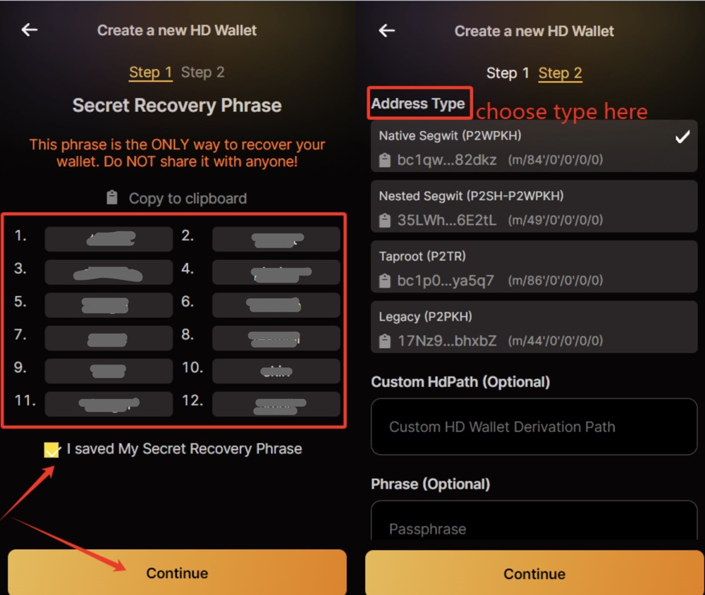

# Using UniSat Wallet with Fractal

## 1. Introduction

This guide provides step-by-step instructions for end-users on how to use the UniSat Wallet browser extension to manage their Fractal (ticker: FB) assets on the Fractal network. It covers essential operations including wallet creation, securing your recovery phrase, switching networks, sending transactions, and checking transaction history.

UniSat Wallet is a third-party browser extension that supports Bitcoin and compatible networks like Fractal.

## 2. Prerequisites

- A compatible web browser (e.g., Google Chrome, Brave).
- Internet access.

## 3. Wallet Setup and Account Generation

**Step 1: Install UniSat Wallet**

- Download and install the UniSat Wallet extension from the official web store for your browser (e.g., Chrome Web Store).

**Step 2: Create a New Wallet**

- Once installed, open the UniSat Wallet extension.
- Click on **"Create new wallet"**.
  

**Step 3: Set Wallet Password**

- You will be prompted to create a password. This password is used to unlock the wallet extension on your device.
- Enter a strong password (at least 8 characters recommended) and confirm it.
- Click **"Confirm"**.
  

**Step 4: Secure Your Secret Recovery Phrase (Seed Phrase)**

- **CRITICAL STEP:** The next screen will display your 12-word Secret Recovery Phrase (also known as a Seed Phrase or Mnemonic).
- **Write down these 12 words accurately, in the exact order shown.** Double-check the spelling.
- **Store this phrase securely offline.** Do not store it digitally (e.g., in emails, cloud storage, text files) where it could be compromised. Anyone with access to this phrase can control your funds. This is the ONLY way to restore your wallet if you lose access to your device or password.
- You will likely be asked to confirm the phrase by re-entering it on the next screen.
  

**Step 5: Access Your Wallet & Switch Network**

- After confirming your recovery phrase, you will be taken to the main wallet interface. Your wallet is now created.
- By default, UniSat Wallet may be set to the **Bitcoin** network.
- To use the Fractal network, click the network selector button (usually in the top-right corner).
- Select **"Fractal"** from the list of available networks.
  

## 4. Important: Backing Up Your Wallet

- **We strongly recommend backing up your Secret Recovery Phrase during the initial setup (Step 4).**
- If you used advanced settings during creation (e.g., custom derivation path, Passphrase), ensure you back up those details securely along with your 12-word phrase. Losing any of these will result in permanent loss of access to your wallet funds.
- If you missed backing up initially, you can usually export your Secret Recovery Phrase later through the wallet's settings menu:
  - Click the Settings icon (often a gear/cogwheel).
  - Look for an option like "View Secret Recovery Phrase" or "Export Seed Phrase".
  - You will likely need to enter your wallet password to view it.
  - **Record and secure this phrase immediately.**
    

## 5. Sending FB (Transaction Construction & Broadcasting)

**Step 1: Initiate Sending**

- Ensure your wallet is connected to the **Fractal** network (check the top-right corner).
- Click the **"Send"** button on the main wallet screen.
  

**Step 2: Enter Transaction Details**

- **Recipient Address:** Paste the recipient's Fractal address into the address field. Double-check the address for accuracy.
- **Amount:** Enter the amount of FB you wish to send.
- **Network Fee Rate:** Choose the fee rate for your transaction.
  - The wallet usually suggests an average fee (`Avg`) based on current network congestion.
  - You can click **"Custom"** to set a specific fee rate (Satoshis per virtual byte - sats/vB). Higher fees generally lead to faster confirmation by miners.
- Review the entered details carefully.
- Click **"Next"** to proceed.
  

**Step 3: Review and Confirm Transaction**

- A confirmation screen will appear, showing all transaction details:
  - Recipient Address
  - Amount to be sent
  - Estimated Network Fee (Miner Fee)
  - Fee Rate used
  - Inputs (The UTXOs from your wallet being spent)
  - Outputs (The new UTXOs being created - including the recipient's and any change back to you)
  - (Optionally: RBF support, PSBT data might be viewable)
- **Verify all details one last time.** Ensure the address and amount are correct.
- If everything looks good, click **"Sign & Pay"** to approve and broadcast the transaction. This signs the transaction using the private key stored securely within the wallet extension.
  

**Step 4: Transaction Broadcasted**

- If the transaction is successfully submitted to the Fractal network, you will see a confirmation message.
- Click **"Done"** to return to the main wallet screen.
  

## 6. Checking Transaction Status

**Step 1: View in Wallet History**

- You can view your recent transaction history directly within the UniSat Wallet.
- Navigate to the **"History"** tab or section in the wallet interface. Pending transactions will often show a "Pending" status, while confirmed ones may show confirmations or a "Success" status.
  

**Step 2: Use a Block Explorer**

- For more detailed tracking, use a Fractal block explorer.
- Go to the UniScan Fractal Explorer: [https://fractal.unisat.io/explorer](https://fractal.unisat.io/explorer)
  
- Find the Transaction ID (TxID) of your sent transaction (usually available in the wallet's history details after broadcasting).
- Search for the TxID on the block explorer.
- **Confirmation:** A transaction is only considered final once it has been included in a block by miners and has received confirmations. A status of "Unconfirmed" or "Pending" means it's waiting in the mempool. "1 Confirmation" or more means it's included in the blockchain. Most services require multiple confirmations (e.g., 6) for full security.
